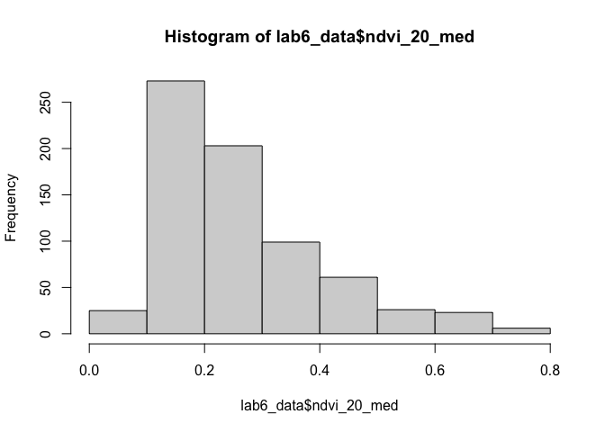
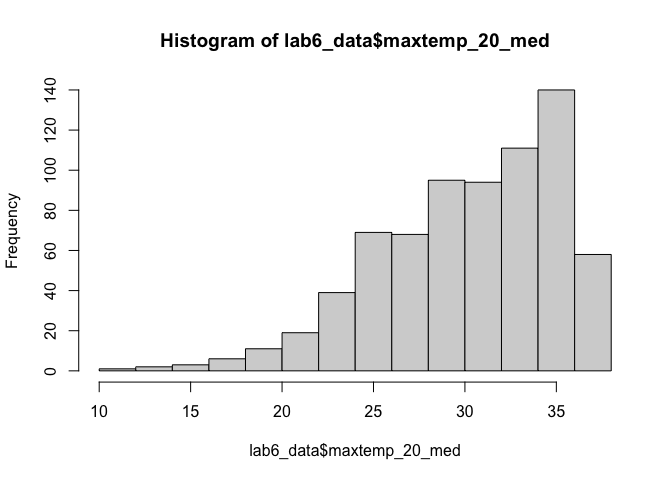
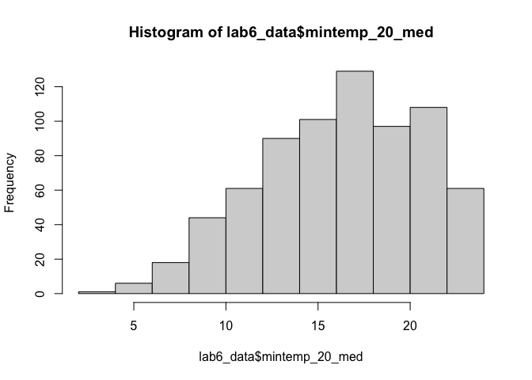
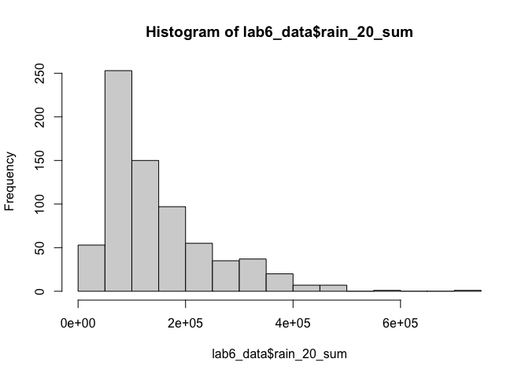
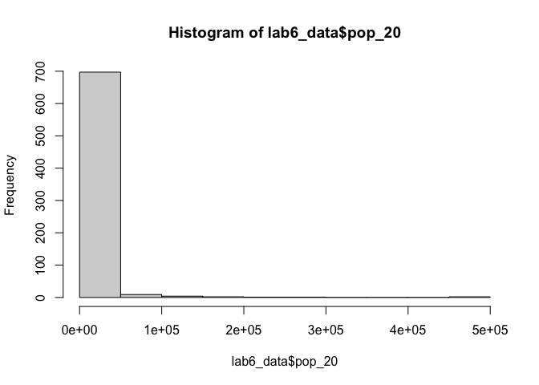
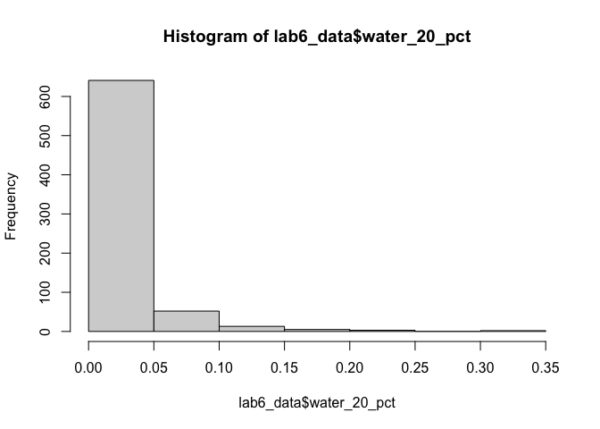
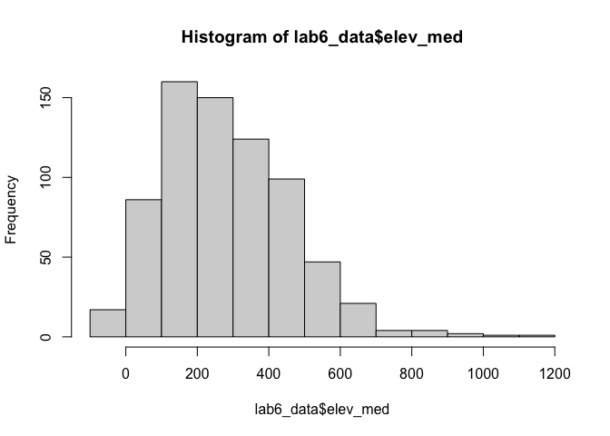
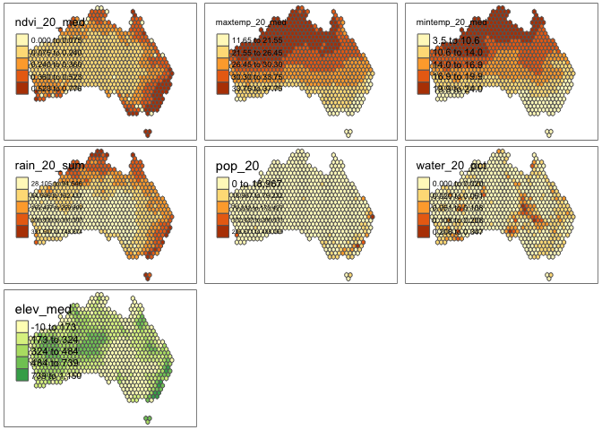
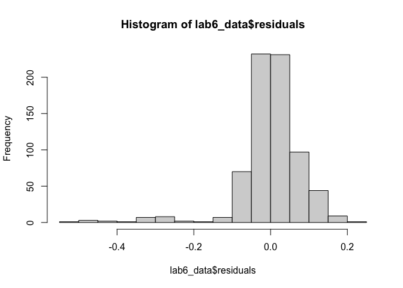
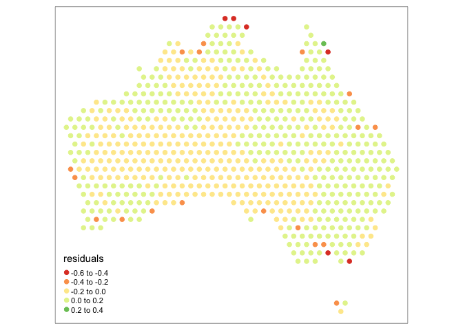

Geog6300: Lab 6
================

## Regression

``` r
library(sf)
library(tidyverse)
library(tmap)
library(knitr)
library(sjPlot)
library(car)
library(lmtest)
```

**Overview:** This lab focuses on regression techniques. You’ll be
analyzing the association of various physical and climatological
characteristics in Australia with observations of several animals
recorded on the citizen science app iNaturalist.

\###Data and research questions###

Let’s import the dataset.

``` r
lab6_data<-st_read("data/aus_climate_inat.gpkg")
```

    ## Reading layer `aus_climate_inat' from data source 
    ##   `/Users/amberorozco/Desktop/GEOG 6300/Lab 6/data/aus_climate_inat.gpkg' 
    ##   using driver `GPKG'
    ## Simple feature collection with 716 features and 22 fields
    ## Geometry type: POLYGON
    ## Dimension:     XY
    ## Bounding box:  xmin: 113.875 ymin: -43.38632 xmax: 153.375 ymax: -11.92074
    ## Geodetic CRS:  WGS 84 (CRS84)

The dataset for this lab is a 1 decimal degree hexagon grid that has
aggregate statistics for a number of variables:

- ndvi: NDVI/vegetation index values from Landsat data (via Google Earth
  Engine). These values range from -1 to 1, with higher values
  indicating more vegetation.
- maxtemp_00/20_med: Median maximum temperature (C) in 2000 or 2020
  (data from SILO/Queensland government)
- mintemp_00/20_med: Median minimum temperature (C) in 2020 or 2020
  (data from SILO/Queensland government)
- rain_00/20_sum: Total rainfall (mm) in 2000 or 2020 (data from
  SILO/Queensland government)
- pop_00/20: Total population in 2000 or 2020 (data from NASA’s Gridded
  Population of the World)
- water_00/20_pct: Percentage of land covered by water at some point
  during the year in 2000 or 2020
- elev_med: Median elevation (meters) (data from the Shuttle Radar
  Topography Mission/NASA)

There are also observation counts from iNaturalist for several
distinctively Australian animal species: the central bearded dragon, the
common emu, the red kangaroo, the agile wallaby, the laughing
kookaburra, the wombat, the koala, and the platypus.

Our primary research question is how the climatological/physical
variables in our dataset are predictive of the NDVI value. We will build
models for 2020 as well as the change from 2000 to 2020. The second is
referred to as a “first difference” model and can sometimes be more
useful for identifying causal mechanisms.

\###Part 1: Analysis of 2020 data###

We will start by looking at data for 2020.

**Question 1** *Create histograms for NDVI, max temp., min temp., rain,
and population, and water in 2020 as well as elevation. Based on these
graphs, assess the normality of these variables.*

``` r
hist(lab6_data$ndvi_20_med)
```

<!-- -->

``` r
hist(lab6_data$maxtemp_20_med)
```

<!-- -->

``` r
hist(lab6_data$mintemp_20_med)
```

<!-- -->

``` r
hist(lab6_data$rain_20_sum)
```

<!-- -->

``` r
hist(lab6_data$pop_20)
```

<!-- -->

``` r
hist(lab6_data$water_20_pct)
```

<!-- -->

``` r
hist(lab6_data$elev_med)
```

<!-- -->

{The NDVI and rainfall variables are skewed to the right. Whereas, the
maximum and minimum temperature values are skewed to the left. The total
population and percentage of land covered by water have a similar
distribution with both variables heavily skewed to the right. The
variable closest to normality or a bell shape is median elevation.
However, this variable is still skewed to the right.}

**Question 2** *Use tmap to map these same variables using Jenks natural
breaks as the classification method. For an extra challenge, use
`tmap_arrange` to plot all maps in a single figure.*

``` r
map1<-tm_shape(lab6_data) +
  tm_polygons("ndvi_20_med",style="jenks")

map2<-tm_shape(lab6_data) +
  tm_polygons("maxtemp_20_med",style="jenks")

map3<-tm_shape(lab6_data) +
  tm_polygons("mintemp_20_med",style="jenks")

map4<-tm_shape(lab6_data) +
  tm_polygons("rain_20_sum",style="jenks")

map5<-tm_shape(lab6_data) +
  tm_polygons("pop_20",style="jenks")

map6<-tm_shape(lab6_data) +
  tm_polygons("water_20_pct",style="jenks")

map7<-tm_shape(lab6_data) +
  tm_polygons("elev_med",style="jenks")

tmap_arrange(map1,map2,map3,map4,map5,map6,map7)
```

    ## Variable(s) "elev_med" contains positive and negative values, so midpoint is set to 0. Set midpoint = NA to show the full spectrum of the color palette.

    ## Legend labels were too wide. The labels have been resized to 0.55, 0.55, 0.55, 0.55, 0.55. Increase legend.width (argument of tm_layout) to make the legend wider and therefore the labels larger.
    ## Legend labels were too wide. The labels have been resized to 0.55, 0.55, 0.55, 0.55, 0.55. Increase legend.width (argument of tm_layout) to make the legend wider and therefore the labels larger.

    ## Some legend labels were too wide. These labels have been resized to 0.66, 0.66, 0.66, 0.66. Increase legend.width (argument of tm_layout) to make the legend wider and therefore the labels larger.

    ## Legend labels were too wide. The labels have been resized to 0.47, 0.44, 0.41, 0.41, 0.41. Increase legend.width (argument of tm_layout) to make the legend wider and therefore the labels larger.

    ## Some legend labels were too wide. These labels have been resized to 0.47, 0.44, 0.41, 0.41. Increase legend.width (argument of tm_layout) to make the legend wider and therefore the labels larger.

    ## Legend labels were too wide. The labels have been resized to 0.55, 0.55, 0.55, 0.55, 0.55. Increase legend.width (argument of tm_layout) to make the legend wider and therefore the labels larger.

    ## Variable(s) "elev_med" contains positive and negative values, so midpoint is set to 0. Set midpoint = NA to show the full spectrum of the color palette.

    ## Some legend labels were too wide. These labels have been resized to 0.63. Increase legend.width (argument of tm_layout) to make the legend wider and therefore the labels larger.

<!-- -->

**Question 3** *Based on the maps from question 3, summarise major
patterns you see in the spatial distribution of these data from any of
your variables of interest. How do they appear to be associated with the
NDVI variable?*

{In 2020, the higher concentration of vegetation for NDVI (0.36 and
greater) was located all along the edges and coastal areas (northern,
eastern, and southwest areas) of the country. For the median maximum
temperature variable, the higher temperatures (33.75 degrees celsius and
greater) are located in the northern half of Australia with median
minimum temperature (19.9 degrees celsius and greater) showing a similar
pattern. Higher sums of rainfall were located along the western and
northern coasts. Interestingly, the highest concentration of population
(172,427 people and greater) was found on the west coast. The highest
percentage of land (10.8% and greater) covered by water were are located
in the central eastern and southwestern areas. Median elevation was
higher along the east coast and western half of the country (484 meters
and greater), with the highest elevation found in the central western
area. There seems to be an overlap in high amounts and concentration
between NDVI and the population, rain, water (southwest corner), and
elevation (southwest corner) variables.}

**Question 4** *Create univariate models for each of the variables
listed in question 1, with NDVI in 2020 as the dependent variable. Print
a summary of each model. Write a summary of those results that indicates
the direction, magnitude, and significance for each model coefficient.*

``` r
model_maxtemp<-lm(ndvi_20_med~maxtemp_20_med,data=lab6_data)
summary(model_maxtemp)
```

    ## 
    ## Call:
    ## lm(formula = ndvi_20_med ~ maxtemp_20_med, data = lab6_data)
    ## 
    ## Residuals:
    ##      Min       1Q   Median       3Q      Max 
    ## -0.41874 -0.07657 -0.01927  0.06833  0.36382 
    ## 
    ## Coefficients:
    ##                  Estimate Std. Error t value Pr(>|t|)    
    ## (Intercept)     0.6612389  0.0294372   22.46   <2e-16 ***
    ## maxtemp_20_med -0.0130902  0.0009601  -13.63   <2e-16 ***
    ## ---
    ## Signif. codes:  0 '***' 0.001 '**' 0.01 '*' 0.05 '.' 0.1 ' ' 1
    ## 
    ## Residual standard error: 0.1251 on 714 degrees of freedom
    ## Multiple R-squared:  0.2066, Adjusted R-squared:  0.2055 
    ## F-statistic: 185.9 on 1 and 714 DF,  p-value: < 2.2e-16

``` r
model_mintemp<-lm(ndvi_20_med~mintemp_20_med,data=lab6_data)
summary(model_mintemp)
```

    ## 
    ## Call:
    ## lm(formula = ndvi_20_med ~ mintemp_20_med, data = lab6_data)
    ## 
    ## Residuals:
    ##      Min       1Q   Median       3Q      Max 
    ## -0.36375 -0.08418 -0.03047  0.06972  0.40383 
    ## 
    ## Coefficients:
    ##                 Estimate Std. Error t value Pr(>|t|)    
    ## (Intercept)     0.464461   0.018997   24.45   <2e-16 ***
    ## mintemp_20_med -0.012282   0.001131  -10.86   <2e-16 ***
    ## ---
    ## Signif. codes:  0 '***' 0.001 '**' 0.01 '*' 0.05 '.' 0.1 ' ' 1
    ## 
    ## Residual standard error: 0.1301 on 714 degrees of freedom
    ## Multiple R-squared:  0.1418, Adjusted R-squared:  0.1406 
    ## F-statistic:   118 on 1 and 714 DF,  p-value: < 2.2e-16

``` r
model_rain<-lm(ndvi_20_med~rain_20_sum,data=lab6_data)
summary(model_rain)
```

    ## 
    ## Call:
    ## lm(formula = ndvi_20_med ~ rain_20_sum, data = lab6_data)
    ## 
    ## Residuals:
    ##      Min       1Q   Median       3Q      Max 
    ## -0.56681 -0.04753 -0.01210  0.04599  0.30930 
    ## 
    ## Coefficients:
    ##              Estimate Std. Error t value Pr(>|t|)    
    ## (Intercept) 1.303e-01  7.060e-03   18.45   <2e-16 ***
    ## rain_20_sum 9.124e-07  3.953e-08   23.08   <2e-16 ***
    ## ---
    ## Signif. codes:  0 '***' 0.001 '**' 0.01 '*' 0.05 '.' 0.1 ' ' 1
    ## 
    ## Residual standard error: 0.1063 on 714 degrees of freedom
    ## Multiple R-squared:  0.4273, Adjusted R-squared:  0.4265 
    ## F-statistic: 532.6 on 1 and 714 DF,  p-value: < 2.2e-16

``` r
model_pop<-lm(ndvi_20_med~pop_20,data=lab6_data)
summary(model_pop)
```

    ## 
    ## Call:
    ## lm(formula = ndvi_20_med ~ pop_20, data = lab6_data)
    ## 
    ## Residuals:
    ##      Min       1Q   Median       3Q      Max 
    ## -0.47003 -0.07883 -0.03949  0.06384  0.48974 
    ## 
    ## Coefficients:
    ##              Estimate Std. Error t value Pr(>|t|)    
    ## (Intercept) 2.552e-01  5.013e-03  50.902   <2e-16 ***
    ## pop_20      1.500e-06  1.500e-07   9.998   <2e-16 ***
    ## ---
    ## Signif. codes:  0 '***' 0.001 '**' 0.01 '*' 0.05 '.' 0.1 ' ' 1
    ## 
    ## Residual standard error: 0.1316 on 714 degrees of freedom
    ## Multiple R-squared:  0.1228, Adjusted R-squared:  0.1216 
    ## F-statistic: 99.97 on 1 and 714 DF,  p-value: < 2.2e-16

``` r
model_water<-lm(ndvi_20_med~water_20_pct,data=lab6_data)
summary(model_water)
```

    ## 
    ## Call:
    ## lm(formula = ndvi_20_med ~ water_20_pct, data = lab6_data)
    ## 
    ## Residuals:
    ##      Min       1Q   Median       3Q      Max 
    ## -0.26898 -0.08838 -0.04838  0.06871  0.50911 
    ## 
    ## Coefficients:
    ##               Estimate Std. Error t value Pr(>|t|)    
    ## (Intercept)   0.268988   0.006287  42.781   <2e-16 ***
    ## water_20_pct -0.178263   0.154480  -1.154    0.249    
    ## ---
    ## Signif. codes:  0 '***' 0.001 '**' 0.01 '*' 0.05 '.' 0.1 ' ' 1
    ## 
    ## Residual standard error: 0.1403 on 714 degrees of freedom
    ## Multiple R-squared:  0.001862,   Adjusted R-squared:  0.0004636 
    ## F-statistic: 1.332 on 1 and 714 DF,  p-value: 0.2489

``` r
model_elev<-lm(ndvi_20_med~elev_med,data=lab6_data)
summary(model_elev)
```

    ## 
    ## Call:
    ## lm(formula = ndvi_20_med ~ elev_med, data = lab6_data)
    ## 
    ## Residuals:
    ##      Min       1Q   Median       3Q      Max 
    ## -0.27082 -0.09585 -0.04270  0.07954  0.44272 
    ## 
    ## Coefficients:
    ##              Estimate Std. Error t value Pr(>|t|)    
    ## (Intercept) 2.138e-01  9.741e-03  21.952  < 2e-16 ***
    ## elev_med    1.787e-04  2.895e-05   6.171 1.14e-09 ***
    ## ---
    ## Signif. codes:  0 '***' 0.001 '**' 0.01 '*' 0.05 '.' 0.1 ' ' 1
    ## 
    ## Residual standard error: 0.1369 on 714 degrees of freedom
    ## Multiple R-squared:  0.05064,    Adjusted R-squared:  0.04931 
    ## F-statistic: 38.08 on 1 and 714 DF,  p-value: 1.136e-09

{ The median maximum temperature and median minimum temperature
variables exhibited similar summary results. Each variable’s coefficient
had a negative relationship, weak magnitude, and had a highly
significant p-value. The median max temp variable had a coefficient of
-0.130902, while the median min temp coefficient was -0.12282. However,
the total population, rain, and elevation variables displayed positive
relationship, weak magnitude, and were highly significant. The
coefficient for the total population variables was 1.500e-06, and the
coefficient for total rain was 9.124e-07.The median max temp, min temp,
total pop, and rain variables had the same p-value of 2e-16. The
elevation variable had a coefficient of 1.787e-04 and a p-value of
1.14e-09. Different from the other variables, the percentage of land
covered by water variable had a insignificant p-value (0.249). The
coefficient for this variable was -0.178263, showing a negative
relationship and a weak magnitude }

**Question 5** *Create a multivariate regression model with the
variables of interest, choosing EITHER max or min temperature (but not
both) You may also choose to leave out any variables that were
insignificant in Q4. Use the univariate models as your guide. Call the
results.*

``` r
model_all<-lm(ndvi_20_med~maxtemp_20_med+rain_20_sum+pop_20+elev_med,data=lab6_data)
summary(model_all)
```

    ## 
    ## Call:
    ## lm(formula = ndvi_20_med ~ maxtemp_20_med + rain_20_sum + pop_20 + 
    ##     elev_med, data = lab6_data)
    ## 
    ## Residuals:
    ##      Min       1Q   Median       3Q      Max 
    ## -0.50217 -0.02838  0.00409  0.03919  0.20570 
    ## 
    ## Coefficients:
    ##                  Estimate Std. Error t value Pr(>|t|)    
    ## (Intercept)     4.571e-01  2.194e-02  20.828  < 2e-16 ***
    ## maxtemp_20_med -1.170e-02  6.796e-04 -17.220  < 2e-16 ***
    ## rain_20_sum     8.469e-07  3.263e-08  25.953  < 2e-16 ***
    ## pop_20          2.862e-07  1.044e-07   2.741  0.00627 ** 
    ## elev_med        1.233e-04  1.796e-05   6.864 1.46e-11 ***
    ## ---
    ## Signif. codes:  0 '***' 0.001 '**' 0.01 '*' 0.05 '.' 0.1 ' ' 1
    ## 
    ## Residual standard error: 0.0845 on 711 degrees of freedom
    ## Multiple R-squared:  0.6397, Adjusted R-squared:  0.6376 
    ## F-statistic: 315.5 on 4 and 711 DF,  p-value: < 2.2e-16

**Question 6** *Summarize the results of the multivariate model. What
are the direction, magnitude, and significance of each coefficient? How
did it change from the univariate models you created in Q4 (if at all)?
What do the R2 and F-statistic values tell you about overall model fit?*

{The coefficient for median max temp for this model is -1.170e-02, which
shows a smaller magnitude compared to the previous model (-0.130902). A
similar trend can be detected for the rain variable with a coefficient
of 8.469e-07 compared to the previous 9.124e-07. The p-values stayed the
same for both variables (2e-16) with is highly significant. The pop
variable also showed a decrease in magnitude in this model with a
coefficient of 2.862e-07 compared to 1.500e-06 in the previous model.
Additionally, the p-value (0.00627) was not as significant.
Additionally, the elevation variable showed a slight decrease in
magnitude for the coefficient (1.233e-04) but had a slighlty more
significant p-value 1.46e-11.

The R2 value of 0.639 tells me the strength of this model is moderate.
The p-value (2.2e-16) of the F-statistic suggest this model is
significant and that one or more of the independent variables is a
predictor of the dependent variable of NDVI.}

**Question 7** *Use a histogram and a map to assess the normality of
residuals and any spatial autocorrelation. Summarise any notable
patterns that you see.*

``` r
lab6_data$residuals<-residuals(model_all)

hist(lab6_data$residuals)
```

<!-- -->

``` r
tm_shape(lab6_data) +
  tm_dots("residuals",size=.2)
```

    ## Variable(s) "residuals" contains positive and negative values, so midpoint is set to 0. Set midpoint = NA to show the full spectrum of the color palette.

<!-- -->

{The histogram shows the residuals are left or negatively skewed. There
are outliers within a negative number, while there also be a higher
frequency of residuals (over 200 range) around 0.00. The larger
residuals are found along the coast of Austrailia, specifically the
southern and Northern coasts. These values mainly reflect negative
residuals.}

**Question 8** *Assess any issues with multicollinearity or
heteroskedastity in this model using the techniques shown in class. Run
the appropriate tests and explain what their results show you.*

``` r
vif(model_all)
```

    ## maxtemp_20_med    rain_20_sum         pop_20       elev_med 
    ##       1.098705       1.078449       1.173863       1.009305

``` r
bptest(model_all)
```

    ## 
    ##  studentized Breusch-Pagan test
    ## 
    ## data:  model_all
    ## BP = 122.21, df = 4, p-value < 2.2e-16

{For the multicollinearity test, the values for all four independent
variables was under 3, ranging from 1.009305 to 1.173863. These values
imply there may be some correlation among the variables. Based on the
p-value (2.2e-16) of the Breusch-Pagan test,there is likley
heteroskedasticity in the model. We can reject the null hypothesis that
the data is uniform.}

**Question 9** *How would you summarise the results of this model in a
sentence or two? In addition, looking at the full model and your
diagnostics, do you feel this is a model that provides meaningful
results? Explain your answer.*

{Based on this model, median maximum temperature, median elevation,
total population, and sum of population are important variables to
consider in predicting NDVI. While the p-values in the summary table
were significant, there was presence of heteroskedastity within the
model. In order to get more significant results and stronger magnitude
for these variable coefficient, it may be necessary to change one or
more of the variables.}

**Disclosure of assistance:** *Besides class materials, what other
sources of assistance did you use while completing this lab? These can
include input from classmates, relevant material identified through web
searches (e.g., Stack Overflow), or assistance from ChatGPT or other AI
tools. How did these sources support your own learning in completing
this lab?*

{I used Google and ChatGPT to revisit the meaning of the different
values and items found in regression summary models. I found these tools
to be helpful in my interpretation of the labd results. I also used
these same materials to revisit the purpose of multicollinearity or
heteroskedastity tests.}

**Lab reflection:** *How do you feel about the work you did on this lab?
Was it easy, moderate, or hard? What were the biggest things you learned
by completing it?*

{I feel good about the work I did for this lab and rate this lab as
moderate. The biggest things I learned by completing the lab was
interpreting the summary results for regression models, as well as
multicollinearity or heteroskedastity tests.}

**Challenge question**

\#Option 1 Create a first difference model. To do that, subtract the
values in 2000 from the values in 2020 for each variable for which that
is appropriate. Then create a new model similar to the one you created
in question 5, but using these new variables showing the *change in
values* over time. Call the results of the model, and interpret the
results in the same ways you did above. Also chart and map the residuals
to assess model error. Finally, write a short section that summarises
what, if anything, this model tells you.

\#Option 2 The animal data included in this dataset is an example of
count data, and usually we would use a Poisson or similar model for that
purpose. Let’s try it with regular OLS regression though. Create two
regression models to assess how the counts of two different animals
(say, koalas and emus) are associated with at least three of the
environmental/climatological variables given above. Be sure to use the
same independent variables in each model. Interpret the results of each
model and then explain the importance of any differences in the model
coefficients between them, focusing on direction, magnitude, and
significance.
